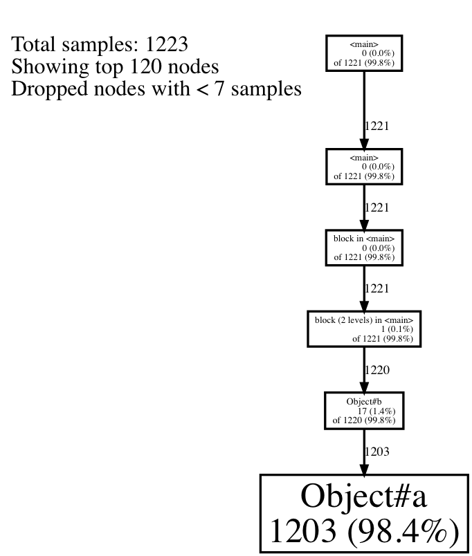

## example of stackprof

```
$ ruby ./sample.rb
$ stackprof --text stackprof-sample.dump
==================================
  Mode: wall(1000)
  Samples: 1223 (63.66% miss rate)
  GC: 2 (0.16%)
==================================
     TOTAL    (pct)     SAMPLES    (pct)     FRAME
      1203  (98.4%)        1203  (98.4%)     Object#a
      1220  (99.8%)          17   (1.4%)     Object#b
      1221  (99.8%)           1   (0.1%)     block (2 levels) in <main>
      1221  (99.8%)           0   (0.0%)     block in <main>
      1221  (99.8%)           0   (0.0%)     <main>
      1221  (99.8%)           0   (0.0%)     <main>
$ stackprof --graphviz stackprof-sample.dump > graph.dot
$ dot -T png -o graph.png graph.dot
```


