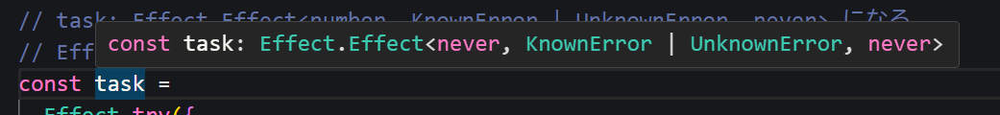
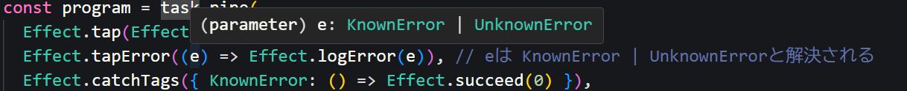

# Effect-Tsいいよ みんなも使おう Effect Effect

TypeScript界のZIOことEffectの紹介です。Effectだとググラビリティが低いので検索したりAIに投げるときはEffect-Tsとしましょう。

## エラーハンドリングが強い

TypeScript(JavaScript)の鬼門ことエラーハンドリングですが、Effectでは起きうるエラーが型パラメータで表現されるので安心安全です。

[playground](https://effect.website/play/#4202933c37b9)

```typescript
import { Effect, Data } from "effect";

class KnownError extends Data.TaggedError("KnownError")<{ message: string }> {}
class UnknownError extends Data.TaggedError("UnknownError")<{
  message: string;
  cause: unknown;
}> {}

// task: Effect.Effect<number, KnownError | UnknownError, never> になる
// Effect.Effectの型パラメータは1. 戻り値, 2. エラー, 3. 依存
const task =
  Effect.try({
    try: () => {
      throw new Error("something known went wrong");
    },
    catch: (e) =>
      e instanceof Error
        ? new KnownError({ message: e.message })
        : new UnknownError({ message: String(e), cause: e }),
  });

// tap: 正常系副作用, tapError: 異常系副作用, catchTags: 特定エラーを握りつぶす
const program = task.pipe(
  Effect.tap(Effect.logInfo),
  Effect.tapError((e) => Effect.logError(e)), // eは KnownError | UnknownErrorと解決される
  Effect.catchTags({ KnownError: () => Effect.succeed(0) }),
);

Effect.runSync(program);

// timestamp=2025-08-26T14:57:17.120Z level=ERROR fiber=#0 message="{
//   \"message\": \"something known went wrong\",
//   \"_tag\": \"KnownError\"
// }"
```




## 並列処理も簡単

並列処理も簡単です。並列数

[playground](https://effect.website/play/#60c7d1dd9eeb)

```
import { Effect } from "effect";

const job = (id: number, delay: number) =>
  Effect.sleep(delay).pipe(Effect.tap(Effect.logInfo), Effect.as(`done ${id}`));

const program = Effect.all([job(1, 300), job(2, 200), job(3, 100)], {
  concurrency: 2,  // 完全並列にしたいときは"unbounded"
}).pipe(Effect.tap(Effect.logInfo));

Effect.runPromise(program);

// timestamp=2025-08-26T15:13:59.984Z level=INFO fiber=#4 message="done 3"\
// timestamp=2025-08-26T15:14:00.083Z level=INFO fiber=#3 message="done 2"\
// timestamp=2025-08-26T15:14:00.182Z level=INFO fiber=#2 message="done 1"\
// timestamp=2025-08-26T15:14:00.185Z level=INFO fiber=#0 message="[\
//   \"done 1\",\
//   \"done 2\",\
//   \"done 3\"\
// ]"
```

## 制御構文

Effect.genで作成するGenerator内ではJavaScriptの制御構文がそのまま使えます。

[playground](https://effect.website/play/#55b1f0933d44)

```typescript
import { Effect } from "effect";

type Admin = {
  email: string;
  kind: "admin";
};

type StandardUser = {
  email: string;
  kind: "standardUser";
};

type User = Admin | StandardUser;

const resolveUser: Effect.Effect<User, never, never> = Effect.succeed({
  email: "hoge@invalid.com",
  kind: "admin",
});

const adminTask = Effect.void;

const program = Effect.gen(function* () {
  const user: User = yield* resolveUser;
  switch (user.kind) {
    case "admin":
      yield* Effect.logInfo("start admin task");
      yield* adminTask;
      yield* Effect.logInfo("finish admin task");
      return;
    case "standardUser":
      return yield* Effect.logInfo("user not authorized");
    default:
      // 網羅性チェック
      const exhaustivenessCheck: never = user;
      break;
  }
});

Effect.runSync(program);

// timestamp=2025-08-26T15:53:45.882Z level=INFO fiber=#0 message="start admin task"
// timestamp=2025-08-26T15:53:45.884Z level=INFO fiber=#0 message="finish admin task"
```


## リトライ処理も簡単

## DI

## ロギング

## 構造化ログ
