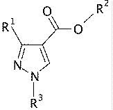
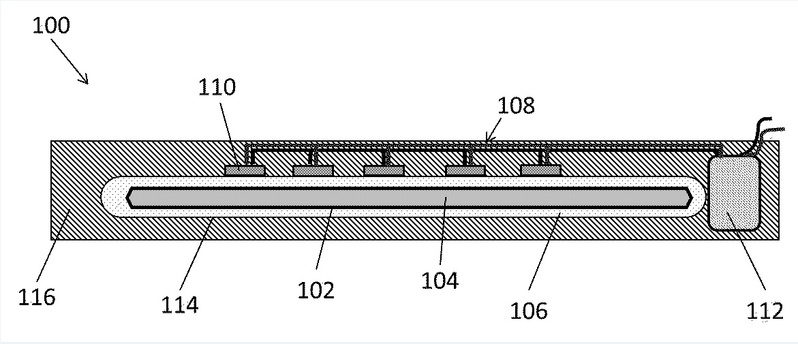
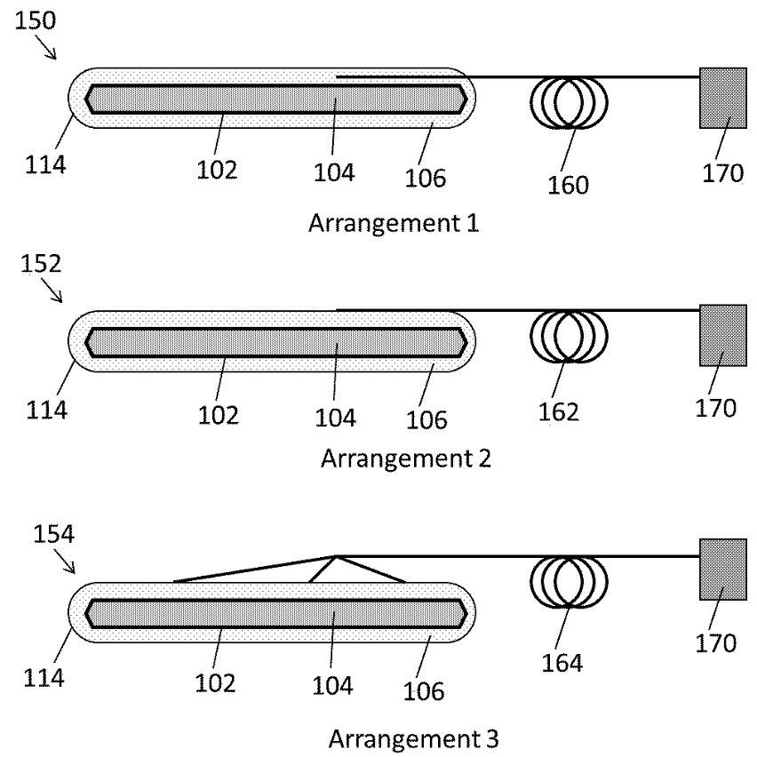

Description

Title of Invention : Sample Application

This is a sample text. The description must disclose the invention in a manner sufficiently clear and complete for it to be carried out by a person skilled in the art. It must start with the title of the invention as appearing in Box No. I of the request. Rule 5 contains detailed requirements as to the “manner and order” of the description, which, generally, should be in six parts. Those parts should have the following headings: “Technical Field”, “Background Art”, “Disclosure of Invention”, “Brief Description of Drawings”, “Best Mode for Carrying Out the Invention” or, where appropriate (see paragraph 115), “Mode(s) for Carrying Out the Invention”, “Industrial Applicability”, and, where applicable, “Sequence Listing” and “Sequence Listing Free Text”

This is a sample text. The description must disclose the invention in a manner sufficiently clear and complete for it to be carried out by a person skilled in the art. It must start with the title of the invention as appearing in Box No. I of the request. Rule 5 contains detailed requirements as to the “manner and order” of the description, which, generally, should be in six parts. Those parts should have the following headings:

This is a sample text. The description must disclose the invention in a manner sufficiently clear and complete for it to be carried out by a person skilled in the art. It must start with the title of the invention as appearing in Box No. I of the request. Rule 5 contains detailed requirements as to the “manner and order” of the description, which, generally, should be in six parts. Those parts should have the following headings:

Technical Field

This is a sample text. For the purposes of according an international filing date, the requirement that the international application be in a prescribed language is met, in most receiving Offices, if the description and claims (but not necessarily the other elements of the international application) are in a language accepted by the receiving Office under Rule 12.1(a) or (c) (see Rule 20.4(c) and paragraph 54). If any of the other elements of the international application are not in a language accepted by the receiving Office, they may be corrected later without affecting the international filing date (see paragraphs 240 and 241).

Background Art

This is a sample text. Second translation will need to be furnished by the applicant in respect of any international application which is filed in a language which is not a language accepted by the International Searching Authority which is to carry out the international search and/or a language of publication; see paragraphs 229 to 236).

Summary of Invention

This is a sample text. In certain Offices, however, Rule 20.4(c) is incompatible with the applicable national law. For as long as that incompatibility continues, that Rule will not apply for those Offices; all elements of an international application filed with those Offices as receiving Office must therefore comply with the language requirements of Rule 12.1 before an international filing date can be accorded (see Annex C for details).

Technical Problem

This is a sample text. What is the effect of failing to file a paper copy of the international application when the request is prepared using the PCT-EASY software? A PCT-EASY diskette filed alone - without any corresponding application papers - does not meet the requirements for according an international filing date. The paper form of the international application remains the legally determinative version. Thus, the paper form of the international application which accompanies a request prepared filed using PCTEASY must contain the required elements in order to receive an international filing date. See paragraph 240A for further details about receiving an international filing date for requests prepared using the PCT-EASY software.

Solution to Problem

This is a sample text. What date is accorded as the international filing date? The reply to this question depends on whether the requirements for according an international filing date (see paragraph 222) were fulfilled on the date on which the international application was received by the receiving Office or - following correction of defects in relation to those requirements - on a later date.

Advantageous Effects of Invention

This is a sample text. The international filing date will, in the former case, be the date on which the international application was received by the receiving Office and, in the latter case, the date on which the correction was received by the receiving Office. Naturally, any correction has to comply with some conditions; in particular it has to be filed within a certain time limit. More is said about this in paragraph 238. Where all the sheets pertaining to the same international application are not received on the same day by the receiving Office, see Rule 20.2 and paragraphs 238(b) and 239.

Brief Description of Drawings

This is a sample text. Does non-payment, incomplete payment or late payment of fees influence the international filing date? The reply to this question is in the negative. However, those defects will eventually lead the receiving Office to declare that the international application is, or certain designations are, considered withdrawn (see paragraphs 213 and 214). Although an international application which has not been accorded an international filing date and an international application which is considered withdrawn are both excluded from further processing in the international phase, an international application which fulfills the requirements necessary for it to be accorded an international filing date may be invoked as a priority application under the Paris Convention for the Protection of Industrial Property (if the conditions laid down by that Convention are fulfilled) even where the international application is considered withdrawn under the PCT (for non-payment of fees or other reasons).

Fig.1

\[fig.1\] illustrates the architecture of the invented product.

Fig.2

\[fig.2\] illustrates the work flow in flow chart.

Description of Embodiments

This is a sample text. This is a sample text. Can the receiving Office refuse to treat an international application as such for reasons of national security? Each Contracting State is free to apply measures deemed necessary for the preservation of its national security. For example, each receiving Office has the right not to treat an international application as such and not to transmit the record copy to the International Bureau and the search copy to the International Searching Authority.

Examples

This is a sample text. Compliance with national security prescriptions where the international application is filed with the International Bureau as receiving Office will not be checked by the International Bureau; such compliance is the applicant’s responsibility. Where an international filing date has been accorded but national security considerations prevent transmittal of the record copy, the receiving Office must so declare to the International Bureau before the expiration of 13, or at the latest 17, months from the priority date.

This is a sample text. This example shows how this invention can be helpful.

\[Math. 1\]

``` math
(x + a)^{n} = \sum_{k = 0}^{n}{\binom{n}{k}x^{k}asdaa^{n - k}}
```

\[Math. 2\]


This is a sample text. This is a sample text. This is a sample text. This is a sample text. This is a sample text. This is a sample text. This is a sample text. This is a sample text. This is a sample text. This is a sample text. This is a sample text. This is a sample text. This is a sample text. This is a sample text. This is a sample text. This is a sample text. This is a sample text. This is a sample text.

\[Table 1\]

<table>
<colgroup>
<col style="width: 10%" />
<col style="width: 16%" />
<col style="width: 11%" />
<col style="width: 11%" />
<col style="width: 11%" />
<col style="width: 10%" />
<col style="width: 9%" />
<col style="width: 20%" />
</colgroup>
<thead>
<tr>
<th></th>
<th></th>
<th colspan="6"><strong>ABC</strong></th>
</tr>
</thead>
<tbody>
<tr>
<td colspan="2">NFkB mutation</td>
<td><strong>CD79A</strong></td>
<td><strong>CD79B</strong></td>
<td><strong>CD79B</strong></td>
<td>TAK1</td>
<td>A20</td>
<td>CARD11</td>
</tr>
<tr>
<td><strong>Target</strong></td>
<td><strong>Compound</strong></td>
<td><strong>OCI-Ly10</strong></td>
<td><strong>HBL1</strong></td>
<td><strong>TMD8</strong></td>
<td><strong>U2392</strong></td>
<td><strong>Su-DHL2</strong></td>
<td><strong>OCI-Ly3</strong></td>
</tr>
<tr>
<td rowspan="3">PKCb</td>
<td>AEB071</td>
<td><strong>1.3</strong></td>
<td colspan="2"><strong>0.50.2</strong></td>
<td>5</td>
<td>&gt;20</td>
<td rowspan="5">&gt;2015&gt;200.412</td>
</tr>
<tr>
<td>Compound D</td>
<td rowspan="2">ND <strong>0.5</strong></td>
<td><strong>0.2</strong></td>
<td><strong>0.2</strong></td>
<td>3</td>
<td>&gt;20</td>
</tr>
<tr>
<td>Compound B</td>
<td><strong>0.5</strong></td>
<td rowspan="2"><strong>0.2 0.2</strong></td>
<td>10</td>
<td>15</td>
</tr>
<tr>
<td rowspan="2">IKKb</td>
<td>Compound A</td>
<td><strong>0.3</strong></td>
<td><strong>2.5</strong></td>
<td>2.5</td>
<td>15</td>
</tr>
<tr>
<td>MLN120B</td>
<td><strong>10</strong></td>
<td><strong>10</strong></td>
<td><strong>10</strong></td>
<td>10</td>
<td>10</td>
</tr>
</tbody>
</table>

\[Table 2\]


Industrial Applicability

This is a sample text. How does the applicant know whether his application has been accorded an international filing date or that his application is not treated as an international application or is considered to have been withdrawn? Where the receiving Office accords an international filing date to the international application, it promptly notifies the applicant of that date and of the international application number; where it decides that the international application is not to be treated as an international application (because of a negative determination for lack of compliance with Article 11, or because national security considerations prevent it from being treated as such) or is to be considered withdrawn, it promptly notifies the applicant accordingly.

\[Chem. 1\]



Reference Signs List

This is a sample text. Web Article on conventional system.

1.  First Item

2.  Second Item

3.  Third Item

    1.  Third Item – One

    2.  Third Item – Two

        1.  Sample Item A

        2.  Sample Item B

4.  Fourth Item

    This is a sample text. Published Article on need of new system to make things simpler.

Reference to Deposited Biological Material

This is a sample text. Compliance with national security prescriptions where the international application is filed with the International Bureau as receiving Office will not be checked by the International Bureau; such compliance is the applicant’s responsibility. Where an international filing date has been accorded but national security considerations prevent transmittal of the record copy, the receiving Office must so declare to the International Bureau before the expiration of 13, or at the latest 17, months from the priority date.

Sequence Listing Free Text

This is a sample text. Compliance with national security prescriptions where the international application is filed with the International Bureau as receiving Office will not be checked by the International Bureau; such compliance is the applicant’s responsibility. Where an international filing date has been accorded but national security considerations prevent transmittal of the record copy, the receiving Office must so declare to the International Bureau before the expiration of 13, or at the latest 17, months from the priority date.

Citation List

Citation List follows:

Patent Literature

This is a sample text. The international filing date will, in the former case, be the date on which the international application was received by the receiving Office and, in the latter case, the date on which the correction was received by the receiving Office. Naturally, any correction has to comply with some conditions; in particular it has to be filed within a certain time limit. More is said about this in paragraph 238. Where all the sheets pertaining to the same international application are not received on the same day by the receiving Office, see Rule 20.2 and paragraphs 238(b) and 239.

PTL1: Patent 2014-000000

PTL2: Patent 2014-999999

Non Patent Literature

This is a sample text. The international filing date will, in the former case, be the date on which the international application was received by the receiving Office and, in the latter case, the date on which the correction was received by the receiving Office. Naturally, any correction has to comply with some conditions; in particular it has to be filed within a certain time limit. More is said about this in paragraph 238. Where all the sheets pertaining to the same international application are not received on the same day by the receiving Office, see Rule 20.2 and paragraphs 238(b) and 239.

NPL1: Patent Publication "Variations of Hand Scanner" Editor Patent John

NPL2: Patent Cooperation "Variations of Printer" Editor PCT John

Claims

1.  This is a sample Claim. First Claim.

2.  This is a sample Claim. The claim or claims must “define the matter for which protection is sought.” Claims must be clear and concise. They must be fully supported by the description. Rule 6 contains detailed requirements as to the number and numbering of claims, the extent to which any claim may refer to other parts of the international application, the manner of claiming, and dependent claims. As to the manner of claiming, the claims must, whenever appropriate, be in two distinct parts; namely, the statement of the prior art and the statement of the features for which protection is sought (“the characterizing portion”).

3.  This is a sample Claim. In principle, under the PCT, any dependent claim which refers to more than one other claim (“multiple dependent claim”) must refer to such claims in the alternative only, and multiple dependent claims cannot serve as a basis for any other multiple dependent claim. However, the national laws of most Contracting States permit a manner of claiming which is different from that provided for in the preceding sentence, and the use of that different manner of claiming is in principle also permitted under the PCT.

4.  This is a sample Claim. For the purposes of those designated States where that different manner of claiming is not permitted, the applicant must decide which drafting style to adopt. If that different manner of claiming is used, amendments may need to be made to the claims during the national phase in those States which do not permit it. Moreover, the national Offices of such States, when they act as International Searching Authorities, may indicate under Article 17(2)(b) that a meaningful search could not be carried out if that different manner of claiming is used (see paragraph 280).

5.  This is a sample Claim. An international application should be drafted so that the claims relate to only one invention or to a group of inventions so linked as to form a single general inventive concept. This principle is laid down in Rule 13. Observance of this requirement is checked by neither the receiving Office nor the International Bureau, but it is checked by, and is important to the procedure before, the International Searching Authority (see paragraphs 281 to 287) and the International Preliminary Examining Authority (see paragraph 398), and may be relevant in the national phase before the designated and elected Offices.

6.  This is a sample Claim. Since separate searches and examinations are required for distinctly different inventions, additional fees are required if the international search or international preliminary examination is to cover two or more inventions (or groups of inventions linked as just described).

7.  This is a sample Claim. The physical requirements are the same as those for the description as outlined in paragraph 120. Note that the claims must commence on a new sheet.

8.  This is a sample Claim. The claims may include tables if this is desirable in view of the subject matter involved. In this case, the tables must be included in the text of the relevant claim; they may not be annexed to the claims nor may reference be made to tables contained in the description (see paragraph 124).

9.  The claims may be amended under Article 19 on receipt of the international search report (see paragraphs 296 to 303); they may also be amended during international preliminary examination if the applicant has filed a demand (see paragraphs 345 and 393) and during the national phase (see Volume II).

10. The claims may be amended under Article 19 on receipt of the international search report (see paragraphs 296 to 303); they may also be amended during.

Abstract

This is a sample text. The abstract must consist of a summary of the disclosure as contained in the description, the claims and any drawings. Where applicable, it must also contain the most characteristic chemical formula. The abstract must be as concise as the disclosure permits (preferably 50 to 150 words if it is in English or when translated into English).

\[Fig. 1\]



\[Fig. 2\]



