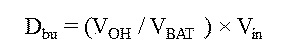
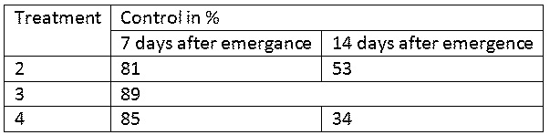

明細書

発明の名称: サンプルスキャナ

技術分野

これはサンプル文書です。本発明は、サンプルのスキャナに関するものである。

背景技術

これはサンプル文書です。これはサンプル文書です。これはサンプル文書です。これはサンプル文書です。これはサンプル文書です。これはサンプル文書です。これはサンプル文書です。\



\
　これはサンプル文書です。これはサンプル文書です。これはサンプル文書です。これはサンプル文書です。これはサンプル文書です。これはサンプル文書です。これはサンプル文書です。これはサンプル文書です。これはサンプル文書です。これはサンプル文書です。これはサンプル文書です。

これはサンプル文書です。これはサンプル文書です。これはサンプル文書です。これはサンプル文書です。これはサンプル文書です。これはサンプル文書です。これはサンプル文書です。これはサンプル文書です。これはサンプル文書です。これはサンプル文書です。これはサンプル文書です。これはサンプル文書です。これはサンプル文書です。これはサンプル文書です。これはサンプル文書です。

これはサンプル文書です。これはサンプル文書です。

先行技術文献

特許文献

特許文献1: 特開２０９９－００００００号公報

特許文献2: 特開２０１１－１１１１１１号公報

非特許文献

非特許文献1: 特許太郎著　「サンプルについて」特許出版　２０００年

非特許文献2:田中一郎著　「サンプルについて」特許出版　２１１１年

発明の概要

発明が解決しようとする課題

これはサンプル文書です。これはサンプル文書です。これはサンプル文書です。これはサンプル文書です。これはサンプル文書です。これはサンプル文書です。

課題を解決するための手段

これはサンプル文書です。これはサンプル文書です。これはサンプル文書です。これはサンプル文書です。これはサンプル文書です。これはサンプル文書です。

発明の効果

これはサンプル文書です。これはサンプル文書です。これはサンプル文書です。これはサンプル文書です。これはサンプル文書です。これはサンプル文書です。これはサンプル文書です。これはサンプル文書です。これはサンプル文書です。これはサンプル文書です。これはサンプル文書です。これはサンプル文書です。

図面の簡単な説明

\[図1\] 図1 はサンプルの説明図である。（実施例１）

\[図2\] 図2 はサンプルの説明の補足である。（実施例２）

発明を実施するための形態

これはサンプル文書です。これはサンプル文書です。これはサンプル文書です。これはサンプル文書です。これはサンプル文書です。これはサンプル文書です。これはサンプル文書です。これはサンプル文書です。

実施例

\[図1\] は、これはサンプル文書です。これはサンプル文書です。これはサンプル文書です。これはサンプル文書です。これはサンプル文書です。これはサンプル文書です。これはサンプル文書です。これはサンプル文書です。これはサンプル文書です。これはサンプル文書です。

これはサンプル文書です。これはサンプル文書です。これはサンプル文書です。これはサンプル文書です。これはサンプル文書です。これはサンプル文書です。これはサンプル文書です。これはサンプル文書です。

\[数 1\]

``` math
(x + a)^{n} = \sum_{k = 0}^{n}{\binom{n}{k}x^{k}asdaa^{n - k}}
```

\[数 2\]


以下はサンプルの表です。

\[表 1\]

<table style="width:94%;">
<colgroup>
<col style="width: 9%" />
<col style="width: 14%" />
<col style="width: 12%" />
<col style="width: 8%" />
<col style="width: 11%" />
<col style="width: 8%" />
<col style="width: 11%" />
<col style="width: 18%" />
</colgroup>
<thead>
<tr>
<th> </th>
<th> </th>
<th colspan="6">ABC</th>
</tr>
</thead>
<tbody>
<tr>
<td colspan="2">NFkB mutation</td>
<td>CD79A</td>
<td>CD79B</td>
<td>CD79B</td>
<td>TAK1</td>
<td>A20</td>
<td>CARD11</td>
</tr>
<tr>
<td>Target</td>
<td>Compound</td>
<td>OCI-Ly10</td>
<td>HBL1</td>
<td>TMD8</td>
<td>U2392</td>
<td>Su-DHL2</td>
<td>OCI-Ly3</td>
</tr>
<tr>
<td rowspan="3">PKCb</td>
<td>AEB071</td>
<td>1.3</td>
<td colspan="2">0.50.2</td>
<td>5</td>
<td>&gt;20</td>
<td rowspan="5">&gt;2015&gt;200.412</td>
</tr>
<tr>
<td>Compound D</td>
<td rowspan="2">ND 0.5</td>
<td>0.2</td>
<td>0.2</td>
<td>3</td>
<td>&gt;20</td>
</tr>
<tr>
<td>Compound B</td>
<td>0.5</td>
<td rowspan="2">0.2 0.2</td>
<td>10</td>
<td>15</td>
</tr>
<tr>
<td rowspan="2">IKKb</td>
<td>Compound A</td>
<td>0.3</td>
<td>2.5</td>
<td>2.5</td>
<td>15</td>
</tr>
<tr>
<td>MLN120B</td>
<td>10</td>
<td>10</td>
<td>10</td>
<td>10</td>
<td>10</td>
</tr>
</tbody>
</table>

これはサンプル文書です。これはサンプル文書です。これはサンプル文書です。これはサンプル文書です。これはサンプル文書です。これはサンプル文書です。これはサンプル文書です。これはサンプル文書です。

これはサンプル文書です。これはサンプル文書です。これはサンプル文書です。これはサンプル文書です。これはサンプル文書です。これはサンプル文書です。これはサンプル文書です。これはサンプル文書です。

\[表 2\]



これはサンプル文書です。これはサンプル文書です。これはサンプル文書です。これはサンプル文書です。これはサンプル文書です。これはサンプル文書です。これはサンプル文書です。これはサンプル文書です。これはサンプル文書です。これはサンプル文書です。これはサンプル文書です。これはサンプル文書です。これはサンプル文書です。これはサンプル文書です。

産業上の利用可能性

これはサンプル文書です。これはサンプル文書です。これはサンプル文書です。これはサンプル文書です。これはサンプル文書です。これはサンプル文書です。これはサンプル文書です。これはサンプル文書です。これはサンプル文書です。これはサンプル文書です。これはサンプル文書です。これはサンプル文書です。これはサンプル文書です。

\[化 1\]


符号の説明

これはサンプル文書です。

1.  箇条書きサンプル　い

2.  箇条書きサンプル　ろ

3.  箇条書きサンプル　は

    1.  箇条書き　は壱号

    2.  箇条書き　は弐号

4.  箇条書きサンプル　に

5.  箇条書きサンプル　ほ

受託番号

これはサンプル文書です。これはサンプル文書です。これはサンプル文書です。これはサンプル文書です。これはサンプル文書です。これはサンプル文書です。これはサンプル文書です。これはサンプル文書です。これはサンプル文書です。これはサンプル文書です。これはサンプル文書です。これはサンプル文書です。これはサンプル文書です。

配列表フリーテキスト

これはサンプル文書です。これはサンプル文書です。これはサンプル文書です。これはサンプル文書です。これはサンプル文書です。これはサンプル文書です。これはサンプル文書です。これはサンプル文書です。これはサンプル文書です。これはサンプル文書です。これはサンプル文書です。これはサンプル文書です。これはサンプル文書です。これはサンプル文書です。これはサンプル文書です。これはサンプル文書です。

請求の範囲

1.  これはサンプル文書です。これはサンプル文書です。これはサンプル文書です。これはサンプル文書です。これはサンプル文書です。これはサンプル文書です。これはサンプル文書です。これはサンプル文書です。これはサンプル文書です。これはサンプル文書です。これはサンプル文書です。これはサンプル文書です。

2.  これはサンプル文書です。これはサンプル文書です。これはサンプル文書です。これはサンプル文書です。これはサンプル文書です。これはサンプル文書です。

3.  これはサンプル文書です。これはサンプル文書です。これはサンプル文書です。これはサンプル文書です。

4.  これはサンプル文書です。

要約書

これはサンプル文書です。これはサンプル文書です。これはサンプル文書です。これはサンプル文書です。これはサンプル文書です。これはサンプル文書です。これはサンプル文書です。これはサンプル文書です。これはサンプル文書です。これはサンプル文書です。これはサンプル文書です。これはサンプル文書です。

\[図1\]


\[図2\]


