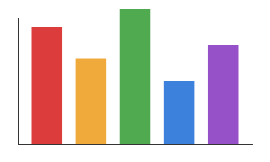

## Slide 1

月次売上レポート

docx/xlsx/pptx → markdown 変換テスト用 pptx fixture

## Slide 2

売上一覧

| 商品名 | 数量 | 単価 | 合計 |
|--------|------|------|------|
| りんご | 3    | 150  | 450  |
| バナナ | 5    | 100  | 500  |
| みかん | 8    | 80   | 640  |

## Slide 3

売上グラフ

各商品の売上を示しています。

## Slide 4

構成比

