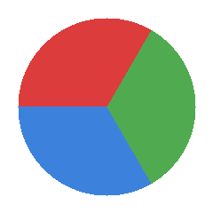

## 売上一覧

| **商品名** | **数量** | **単価** | **合計** |
| --- | --- | --- | --- |
| りんご | 3.0 | 150.0 | 450.0 |
| バナナ | 5.0 | 100.0 | 500.0 |
| みかん | 8.0 | 80.0 | 640.0 |

## 構成比

| **区分** | **割合(%)** |
| --- | --- |
| 個人 | 45.0 |
| 法人 | 35.0 |
| その他 | 20.0 |

| 犬1 | 犬2 | 犬3 |
| --- | --- | --- |
|  |  |  |
